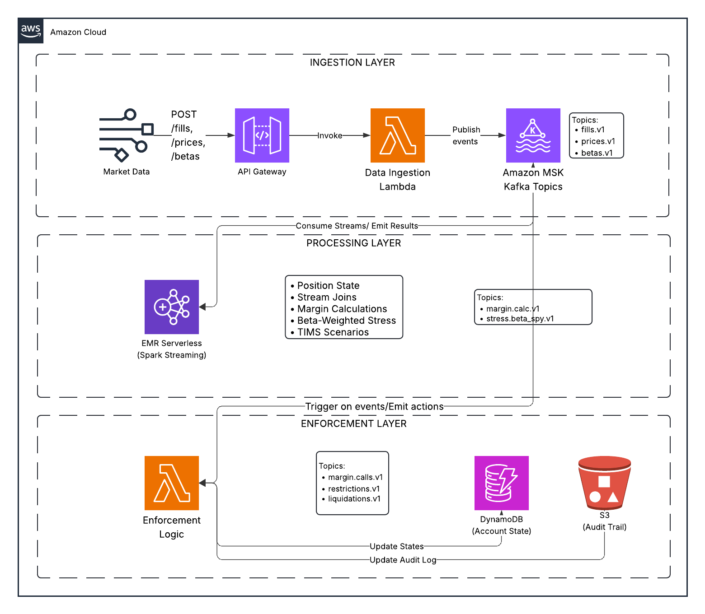

# Real-Time Margin Risk Monitor

A streaming architecture implementing real-time margin risk monitoring inspired by FINRA Rule 4210, portfolio margin methodology, TIMS (Theoretical Intermarket Margining System), and broker house beta-weighted stress testing.

The system implements a separation of concerns between risk calculation, stress testing, and enforcement:

- **Risk Calculation Layer**: Spark Structured Streaming maintains position state and computes margin requirements using SQL aggregations
- **Stress Testing Engine**: Beta-weighted SPY scenarios and TIMS-style portfolio margin analysis detect accounts at risk
- **Enforcement Layer**: Lambda functions apply escalation ladder (warnings → margin calls → restrictions → liquidations)
- **Audit Trail**: Immutable Kafka logs and DynamoDB indexes provide complete traceability

## Key Concepts

### Maintenance Margin vs. Portfolio Margin

The architecture demonstrates two approaches to margin requirements:

**Maintenance Margin (Reg T)**: Fixed percentage of market value (25% baseline)
- Simple calculation: `Requirement = 25% × Market Value`
- House rules can add concentration penalties
- Used for most retail accounts

**Portfolio Margin (TIMS-style)**: Scenario-based worst-case loss
- Evaluates portfolio across multiple market scenarios (-15% to +15%)
- Recognizes hedges and offsets
- Reduces capital requirements for hedged portfolios
- Increases requirements for concentrated, directional risk

### Beta-Weighted Stress Testing

The system converts portfolios to SPY-equivalent exposure for unified stress testing:

```
Beta-Weighted Exposure = Σ (Position Value × Beta to SPY)
Stressed PnL = Beta-Weighted Exposure × SPY Move %
```

This allows house rules like: "Restrict accounts that would be underwater if SPY drops 8%"

### Regulatory Context

Real broker-dealers must comply with FINRA Rule 4210, which requires:

- Minimum maintenance margin of 25% of long market value
- Margin calls when equity falls below requirements
- House requirements can be stricter than regulatory minimums
- Portfolio margin available for eligible accounts ($100k+ equity)

This demo implements these patterns using modern streaming architecture:

- **Real-time monitoring**: Risk updates within seconds as positions and prices change
- **Proactive enforcement**: Detect risk before deficiencies occur
- **Audit trail**: Immutable log of all decisions with correlation IDs

## ⚠️ Educational Disclaimer

**This is an educational demonstration, not production trading software:**

- Uses simplified risk mathematics for teaching
- Not legal or financial advice
- Not suitable for actual trading or risk management
- No real brokerage connectivity
- Consult qualified professionals for production systems

## Architecture



*Real-Time Margin Risk Monitor - System Architecture showing data flow from ingestion through processing to enforcement*

### AWS Serverless Stack
- **Amazon MSK Serverless** - Event streaming backbone
- **EMR Serverless** - PySpark streaming jobs with pre-initialized workers
- **AWS Lambda** - Enforcement logic (Python 3.11+)
- **DynamoDB** - State indexing
- **S3** - Artifacts and audit trail
- **CloudWatch** - Monitoring and logging

### Local Development
- Docker Compose with Kafka and Spark
- Uses pre-built images (Confluent Kafka, Bitnami Spark)
- Mirrors AWS architecture for local testing

## What This System Does

1. **Continuously computes per-account margin risk**
   - Maintains position state from trade fills
   - Joins with real-time prices and beta coefficients
   - Computes maintenance margin requirements (25% of market value)

2. **Implements beta-weighted SPY stress testing**
   - Converts portfolio to SPY-equivalent exposure
   - Tests 8 scenarios: SPY moves from -8% to +6%
   - Identifies accounts that would be underwater under stress

3. **Implements TIMS-style scenario evaluation**
   - Simplified portfolio margin model (10 scenarios: -15% to +15%)
   - Computes portfolio PnL under each scenario
   - Demonstrates scenario-based risk methodology

4. **Escalates through enforcement ladder:**
   - ⚠️ Warning: Excess margin becomes low
   - 📞 Margin Call: Equity below maintenance requirement
   - 🚫 Restriction: Underwater in severe stress scenarios (close-only mode)
   - 💥 Liquidation: Deficiency persists beyond threshold

5. **Produces immutable audit trail**
   - Every event logged with correlation IDs
   - Full causality chain for regulatory review

## Quick Start

### AWS Deployment (30 minutes)

**Prerequisites:**
- AWS account with appropriate permissions
- AWS CLI configured
- Terraform 1.6 or later
- Python 3.11 or later

**Deploy:**

```bash
# Clone repository
git clone https://github.com/lukelittle/finra-4210-margin-risk-monitor-example.git
cd finra-4210-margin-risk-monitor-example

# Deploy infrastructure
cd terraform
terraform init
terraform apply  # Takes ~15 minutes

# Upload Spark job to S3
S3_BUCKET=$(terraform output -raw s3_bucket)
aws s3 cp ../spark/margin_calculator.py s3://$S3_BUCKET/spark/

cd ..

# Warm up workers (run 10-15 minutes before demo)
./scripts/workshop_setup.sh
```

### Local Development (5 minutes)

For quick iteration without AWS costs:

```bash
# Start local stack
docker-compose up -d

# Verify services are running
docker-compose ps

# Access Kafka at localhost:9092
# Access Spark UI at http://localhost:8080
```

## Running the Demo

### Normal Operation

```bash
# Start demo scenario (concentrated high-beta position)
python scripts/demo_scenario.py

# Watch margin calculations
python scripts/observe_streams.py --topic margin.calc.v1

# Watch stress test results
python scripts/observe_streams.py --topic stress.beta_spy.v1
```

**Expected behavior:**
- Account opens 500 shares NVDA at $400 (high beta = 1.8)
- Market declines: SPY drops 8%, NVDA drops ~14%
- System detects underwater scenarios
- Enforcement actions triggered

### Trigger Enforcement Actions

The demo scenario simulates market stress:

1. **T+0**: Account opens concentrated position ($200k NVDA)
   - Beta-weighted exposure: $360k (1.8× leverage)
   - Margin excess: $340k ✅

2. **T+5**: SPY drops 1%, NVDA drops 2%
   - Margin excess: $313k ✅
   - Stress tests show risk building

3. **T+15**: SPY drops 4%, NVDA drops 8%
   - Margin excess: $298k ✅
   - ⚠️ Warning: Low excess margin

4. **T+20**: SPY drops 6%, NVDA drops 12%
   - Margin excess: $282k ✅
   - 🚫 Restriction: Underwater in SPY -8% scenario

5. **T+25**: SPY drops 8%, NVDA drops 16%
   - Margin excess: $259k ✅
   - 📞 Margin call if deficiency persists

### Observe Results

```bash
# View all enforcement actions
python scripts/observe_streams.py --topic margin.calls.v1
python scripts/observe_streams.py --topic restrictions.v1

# View audit trail
python scripts/observe_streams.py --topic audit.v1

# Check DynamoDB for current account state
aws dynamodb query \
  --table-name margin-risk-monitor-account-state \
  --key-condition-expression "account_id = :aid" \
  --expression-attribute-values '{":aid":{"S":"ACC_DEMO_001"}}'
```

## Documentation

Comprehensive guides are available in the `docs/` directory:

- [Architecture Overview](docs/04-architecture.md) - Deep dive into system design
- [Architecture Diagram](docs/images/architecture-diagram.png) - Visual system overview
- [FINRA Rule 4210](docs/01-finra-4210.md) - Regulatory context and requirements
- [What is TIMS?](docs/02-what-is-tims.md) - Portfolio margin methodology
- [Beta Weighting](docs/03-beta-weighting.md) - Market exposure calculation
- [AWS Deployment](docs/05-deploy-aws.md) - Step-by-step deployment guide
- [Run Demo](docs/06-run-demo.md) - Demo scenarios and expected results
- [Observability](docs/07-observe.md) - Monitoring and debugging
- [Exercises](docs/08-exercises.md) - Hands-on learning exercises
- [Cost Management](docs/09-cost-and-cleanup.md) - Cost optimization and cleanup

**For Instructors:**
- [Workshop Guide](WORKSHOP_GUIDE.md) - Complete workshop setup and teaching guide
- [Architecture Explained](ARCHITECTURE_EXPLAINED.md) - Design decisions and trade-offs

## Blog Post

Read the full context and motivation: [Real-Time Margin Risk Monitoring with FINRA Rule 4210](https://lukelittle.com/posts/2026/02/real-time-margin-and-stress-monitoring-finra-rule-4210/)

*Also available in this repository: [blog/posts/real-time-margin-risk-finra-4210.md](blog/posts/real-time-margin-risk-finra-4210.md)*

## Key Formulas

### Maintenance Margin (Reg T Style)
```
Maintenance Requirement = 25% × Market Value
Equity = Cash + Market Value
Excess = Equity - Maintenance Requirement
```

If Excess < 0, the account has a margin deficiency.

### Beta-Weighted Stress Testing
```
Beta-Weighted Exposure = Σ (Position Value × Beta to SPY)
Stressed PnL = Beta-Weighted Exposure × SPY Move %
Equity (stressed) = Equity + Stressed PnL
```

If Equity (stressed) < Maintenance Requirement, the account would be underwater in that scenario.

### TIMS-Style Portfolio Margin
```
For each scenario s in [-15%, -10%, -5%, ..., +15%]:
    Portfolio PnL(s) = Σ (Position Qty × Price × s)

Worst-Case Loss = min(Portfolio PnL across all scenarios)
Portfolio Margin Requirement = |Worst-Case Loss|
```

## Repository Structure

```
.
├── terraform/               # Infrastructure as Code
│   ├── main.tf             # AWS resources (MSK, EMR, Lambda, DynamoDB)
│   └── variables.tf        # Configuration variables
├── spark/                   # PySpark streaming job
│   └── margin_calculator.py # Risk calculation engine
├── lambda/                  # Lambda functions
│   ├── enforcement/        # Enforcement logic
│   └── margin_calculator/  # Alternative Lambda implementation
├── scripts/                 # Helper scripts
│   ├── demo_scenario.py    # Demo data generator
│   ├── observe_streams.py  # Kafka topic viewer
│   └── workshop_setup.sh   # Pre-workshop warmup
├── docker/                  # Docker configurations
│   └── Dockerfile.python   # Python service image
├── docker-compose.yml       # Local development stack
├── docs/                    # Workshop documentation
├── blog/                    # Blog post content
└── tests/                   # Integration tests
```

## Cost Estimates

Typical costs for running the demo:

- **1-hour demo**: $0.87
- **8-hour workshop**: $9.93
- **Local development**: $0

**Cost breakdown:**
- MSK Serverless: $0.25/hour (pay per GB ingested)
- EMR Serverless (pre-init workers): $0.39/hour (keeps workers warm)
- EMR Serverless (jobs): $0.13/hour (actual processing)
- Lambda: $0.00 (free tier)
- DynamoDB: $0.00 (on-demand, free tier)
- S3: $0.00 (minimal storage)

**Why pre-initialized workers?**

The system uses pre-initialized workers in EMR Serverless - a realistic production pattern:

| Configuration | Startup Time | Idle Cost | Use Case |
|---------------|--------------|-----------|----------|
| No pre-init | 2-4 minutes | $0/hour | Batch processing, dev/test |
| Pre-initialized | 30-60 seconds | $0.39/hour | Production, real-time systems |
| Always-on cluster | Instant | $11.67/hour | Legacy systems |

For margin monitoring, fast startup is critical:
- Regulatory compliance requires near real-time monitoring
- 2-4 minute delays could expose firm to losses
- Production systems prioritize availability over cost

**Key insight**: With pre-initialized workers, you pay for fast startup but can still stop completely when not needed ($0 idle).

See [Cost Management](docs/09-cost-and-cleanup.md) for optimization strategies.

## Cleanup

Always destroy infrastructure after use to avoid charges:

```bash
cd terraform
terraform destroy

# Verify no resources remain
aws resourcegroupstaggingapi get-resources \
  --tag-filters Key=Project,Values=margin-risk-monitor
```

For local development:

```bash
# Stop all containers
docker-compose down

# Remove volumes (clears all data)
docker-compose down -v
```


## Testing

Run integration tests to verify the system works:

```bash
# Test local Docker setup
docker-compose up -d
python scripts/demo_scenario.py
python scripts/observe_streams.py

# Verify topics contain data
docker-compose exec kafka kafka-topics --list --bootstrap-server localhost:9092
```

## Learning Objectives

This project teaches:

- **Event-driven architecture** with Kafka
- **Stream processing** with Spark Structured Streaming
- **Stateful aggregations** and stream joins
- **Financial risk modeling** (margin, beta weighting, scenario analysis)
- **Serverless deployment** with Terraform
- **Regulatory compliance patterns** (audit trails, correlation IDs, enforcement)
- **Operational patterns** (monitoring, cost optimization, fault tolerance)

## Security Disclaimer

**This is an educational demonstration, not production trading software:**

- Uses synthetic data only
- No real brokerage connectivity
- Simplified security model for learning
- Not intended for actual trading decisions

For production use, additional controls are required:

- Encryption at rest and in transit
- Comprehensive authentication and authorization
- Rate limiting and DDoS protection
- Security scanning and penetration testing
- Disaster recovery procedures
- Compliance certifications

See [Architecture Explained](ARCHITECTURE_EXPLAINED.md) for detailed discussion.

## Contributing

Contributions are welcome. See [CONTRIBUTING.md](CONTRIBUTING.md) for guidelines.

## License

MIT License - see [LICENSE](LICENSE) file for details.

**Educational use disclaimer**: This software is provided for educational purposes only and should not be used in production trading systems without extensive additional development, testing, and regulatory review.

## Acknowledgments

Built for data and cloud computing education. Inspired by FINRA Rule 4210 margin requirements and OCC TIMS methodology.
