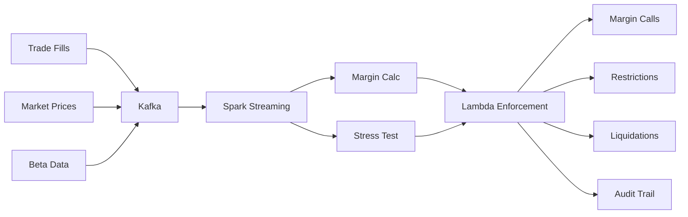

# Overview: Real-Time Margin Risk Monitoring

## Introduction

This system demonstrates how modern broker-dealers monitor margin risk in real-time using streaming architectures. It implements simplified versions of regulatory requirements (FINRA Rule 4210) and industry-standard risk methodologies (TIMS, beta-weighted stress testing).

## The Problem

Broker-dealers face several critical challenges:

1. **Intraday Risk**: Positions and prices change continuously. Risk must be monitored in real-time, not just end-of-day.

2. **Regulatory Compliance**: FINRA Rule 4210 requires maintenance margin monitoring. Deficiencies must be addressed promptly.

3. **Firm Risk**: Even if an account meets regulatory minimums, concentrated or high-beta positions can pose risk to the firm during market stress.

4. **Operational Efficiency**: Manual margin monitoring doesn't scale. Automated systems with clear escalation paths are essential.

## The Solution

This system implements a streaming architecture that:

```
Market Data → Risk Calculation → Enforcement → Audit Trail
```

### Data Flow



### Key Components

#### 1. Data Ingestion (Kafka Topics)

- `fills.v1` - Trade executions
- `prices.v1` - Real-time market prices
- `betas.v1` - Beta coefficients to SPY

#### 2. Risk Calculation (Spark Streaming)

- Maintains position state per account
- Joins fills with prices and betas
- Computes maintenance margin requirements
- Performs beta-weighted stress testing
- Evaluates TIMS-style scenarios
- Emits `margin.calc.v1` and `stress.beta_spy.v1`

#### 3. Enforcement (Lambda)

- Consumes margin and stress events
- Applies escalation ladder logic
- Emits control events:
  - `margin.calls.v1`
  - `restrictions.v1`
  - `liquidations.v1`
- Writes to `audit.v1`

#### 4. Audit Trail (S3 + DynamoDB)

- Immutable event log
- Queryable by account, time, event type
- Supports regulatory examination

## Risk Methodologies

### 1. Maintenance Margin (Reg T Style)

The baseline regulatory requirement:

```
Market Value (MV) = Σ (quantity × price)
Equity = Cash + MV
Maintenance Requirement (MR) = 25% × MV
Excess = Equity - MR
```

If Excess < 0, the account has a margin deficiency.

### 2. House Requirements

Brokers can impose stricter requirements:

**Concentration Add-On**: If a single position exceeds a threshold (e.g., 30% of portfolio), add extra margin:

```
If (Position_i / MV) > 30%:
    MR += 10% × Position_i
```

This protects against idiosyncratic risk.

### 3. Beta-Weighted Stress Testing

Convert the entire portfolio to SPY-equivalent exposure:

```
Beta_i = Cov(Stock_i, SPY) / Var(SPY)
Beta-Weighted Value_i = (qty_i × price_i) × Beta_i
Total Beta-Weighted Exposure = Σ Beta-Weighted Value_i
```

Apply SPY stress scenarios (e.g., -8%, -6%, -4%, -2%, 0%, +2%, +4%, +6%):

```
ΔPnL = Total Beta-Weighted Exposure × SPY_Move%
Equity_stressed = Equity + ΔPnL
Excess_stressed = Equity_stressed - MR
```

If Excess_stressed < 0 in severe scenarios, the account is at risk.

### 4. TIMS-Style Portfolio Margin (Simplified)

TIMS (Theoretical Intermarket Margining System) evaluates risk across a grid of underlying price scenarios.

For each symbol, apply scenarios (e.g., -15%, -10%, -5%, 0%, +5%, +10%, +15%):

```
PnL_symbol_s = qty × price × scenario_s
PnL_portfolio_s = Σ PnL_symbol_s
Worst-Case Loss = min(PnL_portfolio_s)
Portfolio Margin Requirement = |Worst-Case Loss|
```

This captures non-linear risk and allows offsets between correlated positions.

## Enforcement Ladder

The system escalates based on risk severity:

| Condition | Action | Description |
|-----------|--------|-------------|
| Excess < Warning Threshold | WARNING | Alert sent, no trading restriction |
| Excess < 0 | MARGIN_CALL | Customer must deposit funds or reduce positions |
| Underwater in severe stress | RESTRICTION | Account set to close-only mode |
| Deficiency persists > threshold | LIQUIDATION | Firm liquidates positions to restore compliance |

## Why Streaming?

Traditional batch systems compute risk end-of-day. But:

- Intraday volatility can create deficiencies
- Positions change continuously
- Regulatory expectations are moving toward real-time monitoring

Streaming architecture enables:

- **Low Latency**: Risk updates within seconds of trades or price changes
- **Scalability**: Handles thousands of accounts and millions of events
- **Auditability**: Every event is captured with timestamps and causality
- **Resilience**: Fault-tolerant, exactly-once processing

## Technology Choices

### AWS Serverless

- **MSK Serverless**: Managed Kafka without cluster sizing
- **EMR Serverless**: Spark jobs without always-on clusters
- **Lambda**: Event-driven enforcement logic
- **DynamoDB**: Fast state lookups
- **S3**: Durable audit storage

Benefits:
- Pay only for what you use
- Auto-scaling
- Minimal operational overhead
- Focus on business logic, not infrastructure

### Local Docker

For development and learning:
- Kafka (Confluent)
- Spark (standalone mode)
- Python services

Mirrors AWS design for portability.

## Learning Path

1. **Understand the Math** (Docs 01-03): Learn margin calculations, beta weighting, TIMS
2. **Understand the Architecture** (Doc 04): See how components fit together
3. **Deploy Locally** (Doc 06): Run the system on your laptop
4. **Deploy to AWS** (Doc 05): Experience cloud deployment
5. **Observe Behavior** (Doc 07): Watch the enforcement ladder in action
6. **Complete Exercises** (Doc 08): Extend the system with new features

## Next Steps

- [01 - FINRA Rule 4210](01-finra-4210.md) - Understand the regulatory context
- [02 - What is TIMS?](02-what-is-tims.md) - Learn about portfolio margin
- [03 - Beta Weighting](03-beta-weighting.md) - Master stress testing math
