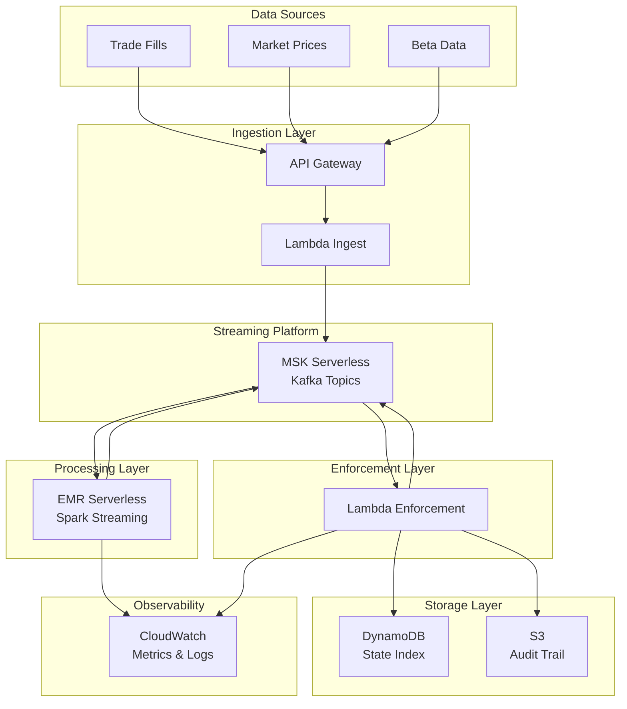

# Architecture

## System Overview

This system implements a real-time margin risk monitoring pipeline using event-driven architecture and streaming processing.



## Kafka Topics

### Input Topics

| Topic | Schema | Purpose |
|-------|--------|---------|
| `fills.v1` | `{account_id, symbol, qty, price, timestamp, fill_id}` | Trade executions |
| `prices.v1` | `{symbol, price, timestamp}` | Real-time market prices |
| `betas.v1` | `{symbol, beta, timestamp}` | Beta coefficients to SPY |

### Output Topics

| Topic | Schema | Purpose |
|-------|--------|---------|
| `margin.calc.v1` | `{account_id, equity, mv, mr, excess, ...}` | Margin calculations |
| `stress.beta_spy.v1` | `{account_id, scenario, underwater, ...}` | Stress test results |
| `margin.calls.v1` | `{account_id, deficiency, timestamp, ...}` | Margin call events |
| `restrictions.v1` | `{account_id, action, reason, ...}` | Account restrictions |
| `liquidations.v1` | `{account_id, positions, ...}` | Liquidation triggers |
| `audit.v1` | `{event_type, account_id, details, ...}` | Immutable audit trail |

## Component Details

### 1. API Gateway + Lambda Ingest

**Purpose**: Accept external data and publish to Kafka

**Technology**:
- API Gateway HTTP API
- Lambda (Python 3.11)
- MSK IAM authentication

**Endpoints**:
```
POST /fills
POST /prices
POST /betas
```

**Lambda Logic**:
```python
def lambda_handler(event, context):
    # Parse request
    body = json.loads(event['body'])
    
    # Validate schema
    validate_fill(body)
    
    # Publish to Kafka
    producer.send('fills.v1', value=body)
    
    return {'statusCode': 200}
```

**IAM Policy**:
```json
{
  "Effect": "Allow",
  "Action": [
    "kafka-cluster:Connect",
    "kafka-cluster:WriteData"
  ],
  "Resource": "arn:aws:kafka:*:*:topic/*/fills.v1"
}
```

### 2. MSK Serverless

**Purpose**: Event streaming backbone

**Configuration**:
- Serverless (auto-scaling)
- IAM authentication
- Retention: 7 days
- Partitions: 3 per topic (keyed by account_id)

**Why MSK Serverless?**
- No cluster sizing
- Pay per GB ingested + storage
- Auto-scales to workload
- Managed service (no ops)

**Topic Configuration**:
```python
topics = {
    'fills.v1': {'partitions': 3, 'replication': 2},
    'prices.v1': {'partitions': 3, 'replication': 2},
    'betas.v1': {'partitions': 1, 'replication': 2},
    'margin.calc.v1': {'partitions': 3, 'replication': 2},
    'stress.beta_spy.v1': {'partitions': 3, 'replication': 2},
    'margin.calls.v1': {'partitions': 3, 'replication': 2},
    'restrictions.v1': {'partitions': 3, 'replication': 2},
    'liquidations.v1': {'partitions': 3, 'replication': 2},
    'audit.v1': {'partitions': 3, 'replication': 2},
}
```

### 3. EMR Serverless (Spark Streaming)

**Purpose**: Stateful stream processing

**Technology**:
- EMR Serverless (Spark 3.5+)
- PySpark Structured Streaming
- Kafka source and sink

**Why EMR Serverless?**
- No always-on clusters
- Pay per vCPU-hour and GB-hour
- Auto-scales workers
- Managed Spark runtime

**Job Configuration**:
```json
{
  "name": "margin-risk-calculator",
  "sparkSubmit": {
    "entryPoint": "s3://bucket/spark/margin_calculator.py",
    "sparkSubmitParameters": "--conf spark.executor.memory=4g --conf spark.executor.cores=2"
  },
  "applicationConfiguration": {
    "classification": "spark-defaults",
    "properties": {
      "spark.sql.streaming.checkpointLocation": "s3://bucket/checkpoints/margin-calc"
    }
  }
}
```

**Spark Job Logic** (see [Spark Implementation](#spark-implementation) below)

### 4. Lambda Enforcement

**Purpose**: Evaluate margin and stress events, apply enforcement ladder

**Technology**:
- Lambda (Python 3.11)
- Event source: Kafka (MSK trigger)
- Destinations: Kafka, DynamoDB, S3

**Trigger Configuration**:
```python
event_source_mapping = {
    'EventSourceArn': msk_cluster_arn,
    'Topics': ['margin.calc.v1', 'stress.beta_spy.v1'],
    'StartingPosition': 'LATEST',
    'BatchSize': 100,
    'MaximumBatchingWindowInSeconds': 5
}
```

**Enforcement Logic**:
```python
def enforce_margin(margin_event):
    account_id = margin_event['account_id']
    excess = margin_event['excess']
    
    if excess < WARNING_THRESHOLD:
        emit_warning(account_id, excess)
    
    if excess < 0:
        emit_margin_call(account_id, abs(excess))
        
        # Check if call is stale
        if is_call_stale(account_id):
            emit_restriction(account_id, 'CLOSE_ONLY')
            
            if still_deficient(account_id):
                emit_liquidation(account_id)

def enforce_stress(stress_event):
    account_id = stress_event['account_id']
    scenario = stress_event['scenario']
    underwater = stress_event['underwater']
    
    # Restrict if underwater in severe scenario
    if underwater and abs(scenario) >= 0.06:
        emit_restriction(
            account_id,
            'CLOSE_ONLY',
            reason=f'Underwater in SPY {scenario:.1%} scenario'
        )
```

### 5. DynamoDB State Index

**Purpose**: Fast lookups of current account state

**Schema**:
```python
{
    'account_id': 'ACC123',  # Partition key
    'timestamp': 1234567890,  # Sort key
    'equity': 100000,
    'market_value': 95000,
    'maintenance_req': 23750,
    'excess': 76250,
    'status': 'ACTIVE',  # ACTIVE | WARNING | MARGIN_CALL | RESTRICTED
    'margin_call_issued_at': None,
    'ttl': 1234567890  # Auto-delete after 30 days
}
```

**Access Patterns**:
- Get current state: `GetItem(account_id, latest timestamp)`
- Query history: `Query(account_id, timestamp range)`

### 6. S3 Audit Trail

**Purpose**: Immutable, queryable event log

**Structure**:
```
s3://bucket/audit/
  year=2026/
    month=02/
      day=16/
        hour=14/
          audit-events-{timestamp}.json.gz
```

**Partitioning**: By event time for efficient querying with Athena

**Schema**:
```json
{
  "event_id": "uuid",
  "event_type": "MARGIN_CALL",
  "account_id": "ACC123",
  "timestamp": "2026-02-16T14:30:00Z",
  "details": {
    "deficiency": 5000,
    "equity": 20000,
    "maintenance_req": 25000
  },
  "correlation_id": "uuid",
  "causation_id": "uuid"
}
```

**Querying with Athena**:
```sql
SELECT * FROM audit_events
WHERE year = 2026 AND month = 2 AND day = 16
  AND account_id = 'ACC123'
  AND event_type = 'MARGIN_CALL'
ORDER BY timestamp;
```

## Spark Implementation

### Job: Margin Risk Calculator

**File**: `spark/margin_calculator.py`

**Logic**:

```python
from pyspark.sql import SparkSession
from pyspark.sql.functions import *
from pyspark.sql.types import *

spark = SparkSession.builder.appName("MarginRiskCalculator").getOrCreate()

# Read streams
fills_df = spark.readStream \
    .format("kafka") \
    .option("kafka.bootstrap.servers", KAFKA_BROKERS) \
    .option("subscribe", "fills.v1") \
    .load() \
    .select(from_json(col("value").cast("string"), fills_schema).alias("data")) \
    .select("data.*")

prices_df = spark.readStream \
    .format("kafka") \
    .option("kafka.bootstrap.servers", KAFKA_BROKERS) \
    .option("subscribe", "prices.v1") \
    .load() \
    .select(from_json(col("value").cast("string"), prices_schema).alias("data")) \
    .select("data.*")

betas_df = spark.readStream \
    .format("kafka") \
    .option("kafka.bootstrap.servers", KAFKA_BROKERS) \
    .option("subscribe", "betas.v1") \
    .load() \
    .select(from_json(col("value").cast("string"), betas_schema).alias("data")) \
    .select("data.*")

# Maintain position state
positions_df = fills_df.groupBy("account_id", "symbol") \
    .agg(sum("qty").alias("qty"))

# Join with latest prices
positions_with_prices = positions_df.join(
    prices_df.groupBy("symbol").agg(last("price").alias("price")),
    on="symbol",
    how="left"
)

# Compute market value
positions_with_prices = positions_with_prices.withColumn(
    "market_value",
    col("qty") * col("price")
)

# Join with betas
positions_with_beta = positions_with_prices.join(
    betas_df.groupBy("symbol").agg(last("beta").alias("beta")),
    on="symbol",
    how="left"
).fillna({"beta": 1.0})

# Compute beta-weighted value
positions_with_beta = positions_with_beta.withColumn(
    "beta_weighted_value",
    col("market_value") * col("beta")
)

# Aggregate per account
account_summary = positions_with_beta.groupBy("account_id").agg(
    sum("market_value").alias("total_mv"),
    sum("beta_weighted_value").alias("beta_weighted_exposure")
)

# Compute margin (simplified: assume cash = 0.1 * MV)
account_summary = account_summary.withColumn("cash", col("total_mv") * 0.1)
account_summary = account_summary.withColumn("equity", col("cash") + col("total_mv"))
account_summary = account_summary.withColumn("maintenance_req", col("total_mv") * 0.25)
account_summary = account_summary.withColumn("excess", col("equity") - col("maintenance_req"))

# Emit margin.calc.v1
margin_query = account_summary.selectExpr("to_json(struct(*)) AS value") \
    .writeStream \
    .format("kafka") \
    .option("kafka.bootstrap.servers", KAFKA_BROKERS) \
    .option("topic", "margin.calc.v1") \
    .option("checkpointLocation", "s3://bucket/checkpoints/margin-calc") \
    .start()

# Stress testing
spy_scenarios = [-0.08, -0.06, -0.04, -0.02, 0.0, 0.02, 0.04, 0.06]

for scenario in spy_scenarios:
    stress_df = account_summary.withColumn("scenario", lit(scenario))
    stress_df = stress_df.withColumn("delta_pnl", col("beta_weighted_exposure") * lit(scenario))
    stress_df = stress_df.withColumn("equity_stressed", col("equity") + col("delta_pnl"))
    stress_df = stress_df.withColumn("excess_stressed", col("equity_stressed") - col("maintenance_req"))
    stress_df = stress_df.withColumn("underwater", col("excess_stressed") < 0)
    
    stress_query = stress_df.selectExpr("to_json(struct(*)) AS value") \
        .writeStream \
        .format("kafka") \
        .option("kafka.bootstrap.servers", KAFKA_BROKERS) \
        .option("topic", "stress.beta_spy.v1") \
        .option("checkpointLocation", f"s3://bucket/checkpoints/stress-{scenario}") \
        .start()

spark.streams.awaitAnyTermination()
```

## Data Flow Example

### Scenario: Account Builds Concentrated Position

1. **T+0 09:30**: Account ACC123 buys 1000 NVDA at $400
   - Event: `fills.v1` → `{account_id: ACC123, symbol: NVDA, qty: 1000, price: 400}`

2. **T+0 09:30:05**: Spark processes fill
   - Updates position state: ACC123 has 1000 NVDA
   - Joins with price: $400
   - Joins with beta: 1.8
   - Computes:
     - MV: $400,000
     - Beta-weighted: $720,000
     - Equity: $440,000 (assuming $40k cash)
     - MR: $100,000 (25%)
     - Excess: $340,000 ✓
   - Emits: `margin.calc.v1`

3. **T+0 09:30:10**: Spark runs stress tests
   - SPY -8% scenario:
     - ΔPnL: $720,000 × -0.08 = -$57,600
     - Equity_stressed: $440,000 - $57,600 = $382,400
     - Excess_stressed: $382,400 - $100,000 = $282,400 ✓
   - Emits: `stress.beta_spy.v1` (not underwater)

4. **T+0 14:00**: SPY drops 5%, NVDA drops 9% (1.8× beta)
   - Event: `prices.v1` → `{symbol: NVDA, price: 364}`

5. **T+0 14:00:05**: Spark recomputes
   - MV: $364,000
   - Beta-weighted: $655,200
   - Equity: $404,000
   - MR: $91,000
   - Excess: $313,000 ✓
   - Emits: `margin.calc.v1`

6. **T+0 14:00:10**: Spark runs stress tests
   - SPY -8% scenario (from current level):
     - ΔPnL: $655,200 × -0.08 = -$52,416
     - Equity_stressed: $404,000 - $52,416 = $351,584
     - Excess_stressed: $351,584 - $91,000 = $260,584 ✓
   - Emits: `stress.beta_spy.v1` (still not underwater)

7. **T+0 15:30**: SPY drops another 3% (total -8%), NVDA drops 5.4%
   - Event: `prices.v1` → `{symbol: NVDA, price: 344.36}`

8. **T+0 15:30:05**: Spark recomputes
   - MV: $344,360
   - Equity: $384,360
   - MR: $86,090
   - Excess: $298,270 ✓
   - Emits: `margin.calc.v1`

9. **T+0 15:30:10**: Spark runs stress tests
   - SPY -8% scenario:
     - Beta-weighted: $619,848
     - ΔPnL: -$49,588
     - Equity_stressed: $334,772
     - Excess_stressed: $248,682 ✓
   - SPY -10% scenario:
     - ΔPnL: -$61,985
     - Equity_stressed: $322,375
     - Excess_stressed: $236,285 ✓
   - Emits: `stress.beta_spy.v1` (still passing)

10. **T+0 15:45**: Hypothetical extreme move: SPY -15% total
    - NVDA would be at ~$292 (27% down from $400)
    - MV: $292,000
    - Equity: $332,000
    - MR: $73,000
    - Excess: $259,000 ✓
    - But stress test shows:
      - Beta-weighted: $525,600
      - SPY -8% from here: ΔPnL = -$42,048
      - Equity_stressed: $289,952
      - Excess_stressed: $216,952 ✓
    - Account survives even extreme stress

11. **Lambda Enforcement**: Monitors all events
    - No action needed (account healthy)

## Scalability

### Throughput

- **Kafka**: 100+ MB/s per partition
- **Spark**: Scales workers based on lag
- **Lambda**: 1000 concurrent executions

### Latency

- **Ingestion to Kafka**: <100ms
- **Spark processing**: 5-10 seconds (micro-batch)
- **Enforcement**: <1 second

### Cost

- **MSK**: ~$2.50/GB ingested
- **EMR**: ~$0.05/vCPU-hour
- **Lambda**: $0.20/1M requests
- **Demo**: ~$5-10 total

## Observability

### CloudWatch Metrics

- Kafka: `BytesInPerSec`, `BytesOutPerSec`, `ConsumerLag`
- Spark: `numInputRows`, `inputRowsPerSecond`, `processedRowsPerSecond`
- Lambda: `Invocations`, `Errors`, `Duration`

### CloudWatch Logs

- Structured JSON logging
- Correlation IDs for tracing
- Error stack traces

### Dashboards

- Real-time margin distribution
- Stress test pass/fail rates
- Enforcement action counts
- System health metrics

## Next Steps

- [05 - Deploy AWS](05-deploy-aws.md) - Deploy to AWS
- [06 - Run Demo](06-run-demo.md) - Run the demo scenario
- [07 - Observe](07-observe.md) - Monitor the system
